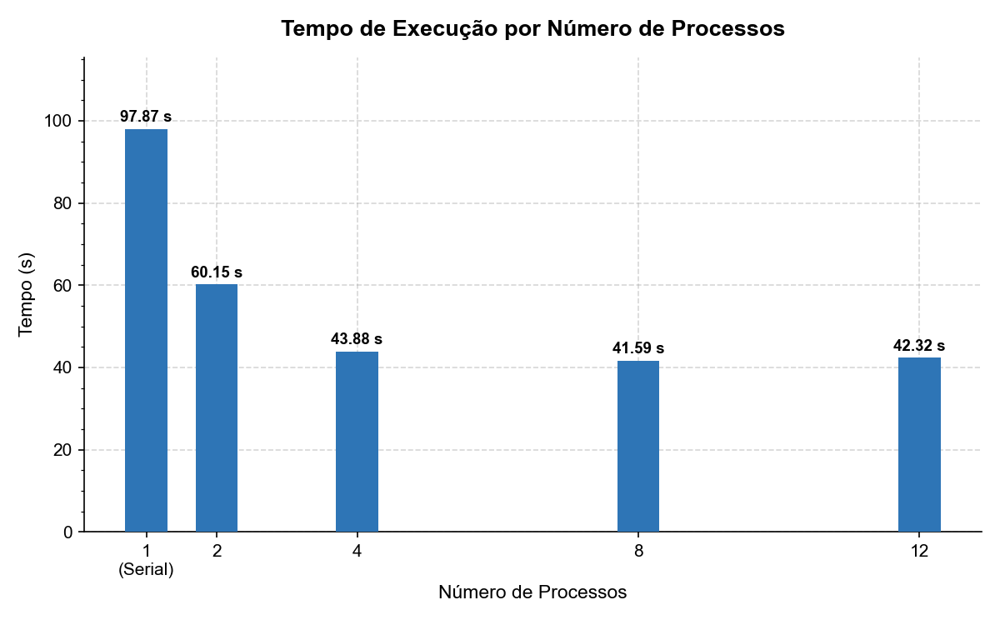
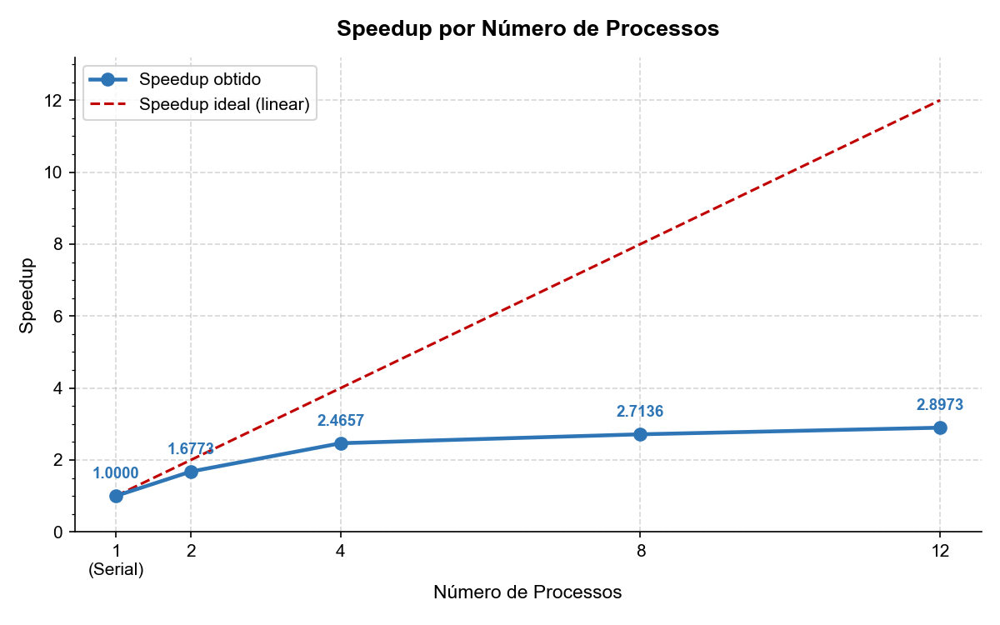
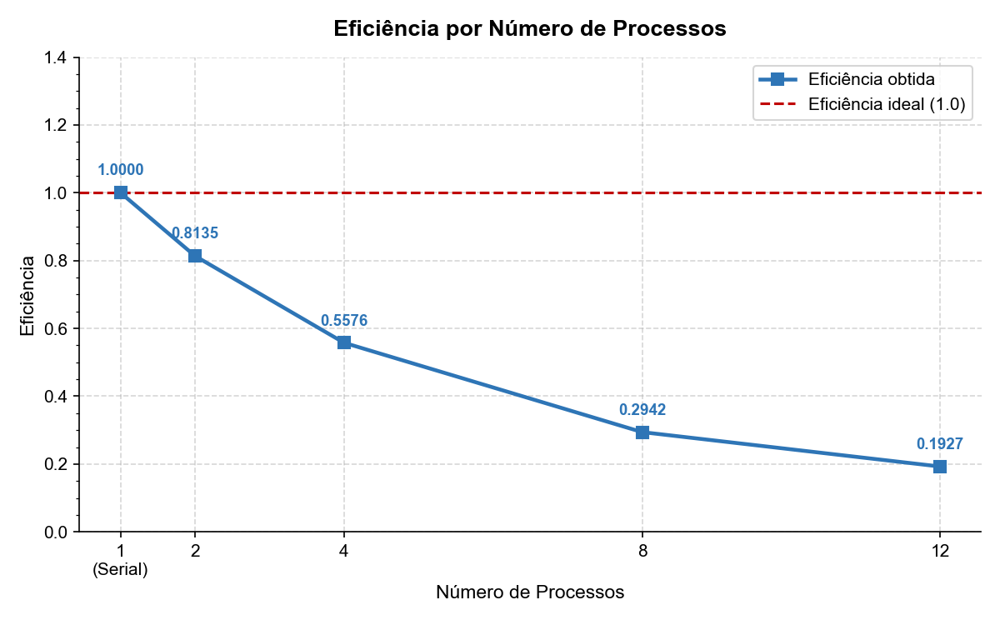

# Relatório de Análise de Desempenho - Atividade 3

**Disciplina:** PROGRAMAÇÃO CONCORRENTE E DISTRIBUÍDA  
**Alunos:** João Victor Fernandes De Oliveira (RA: 083318) | Tiago Geraldo de Lima Cosme (RA: 083095)  
**Turma:** ADS  
**Professor:** Rafael Marconi  
**Data:** 02/06/2026  

---

# 1. Descrição do Problema

O programa resolve o problema de classificação automática de vagas de estacionamento a partir de imagens capturadas por câmeras de vigilância. O sistema percorre recursivamente uma massa de imagens do dataset **PKLot (UFPR04 + UFPR05)** para classificar cada vaga como **livre** ou **ocupada** utilizando técnicas de visão computacional com OpenCV.

* **Algoritmo:** Para cada imagem, o sistema aplica conversão para escala de cinza, filtro Gaussiano, detecção de bordas (Canny) e calcula um score combinado de densidade de bordas e desvio padrão — vagas ocupadas possuem mais bordas e textura (contorno do veículo). O modelo paralelo utiliza **`multiprocessing.Pool`** para distribuir o processamento entre múltiplos processos.
* **Tamanho da Entrada:** 7.416 imagens JPEG (UFPR04 + UFPR05), totalizando ~1,95 GB.
* **Objetivo:** O objetivo da paralelização é reduzir o tempo total de resposta (latency) ao distribuir a carga de processamento de imagens entre os múltiplos núcleos da CPU, superando o gargalo da execução sequencial.
* **Complexidade:** Aproximadamente $O(n \times p)$, onde $n$ é o número de imagens e $p$ é o custo de processamento por imagem (filtros + cálculo de bordas).

---

# 2. Ambiente Experimental

| Item                        | Descrição |
| --------------------------- | --------- |
| Processador                 | 11th Gen Intel(R) Core(TM) i5-11400H @ 2.70GHz |
| Número de núcleos           | 6 Núcleo(s) / 12 Threads |
| Memória RAM                 | 8,00 GB |
| Sistema Operacional         | Microsoft Windows 11 Home Single Language |
| Linguagem utilizada         | Python 3.x |
| Biblioteca de paralelização | Multiprocessing (stdlib) |
| Bibliotecas de visão        | OpenCV, NumPy |
| Compilador / Versão         | Python 3.x |

---

# 3. Metodologia de Testes

Os experimentos foram conduzidos medindo o tempo total de execução ("Wall Time") utilizando a função `time.perf_counter()`.

* **Execuções:** Foi realizada uma medição para cada configuração de processos.
* **Entrada:** Massa de teste fixa (pastas UFPR04 + UFPR05) com 7.416 imagens JPEG.
* **Configurações:** Testes realizados com 1 (serial), 2, 4, 8 e 12 processos.
* **Condições:** Execução em máquina local, com carga de sistema variável (processos de fundo do SO ativos).

---

# 4. Resultados Experimentais

| Nº Threads/Processos | Tempo de Execução (s) |
| -------------------- | --------------------- |
| 1 (Serial)           | 140.2143              |
| 2                    | 61.8382               |
| 4                    | 44.8976               |
| 8                    | 41.0309               |
| 12                   | 43.0464               |

---

# 6. Tabela de Resultados (Cálculos)

| Threads/Processos | Tempo (s) | Speedup | Eficiência |
| ----------------- | --------- | ------- | ---------- |
| 1                 | 140.2143  | 1.0000  | 1.0000     |
| 2                 | 61.8382   | 2.2674  | 1.1337     |
| 4                 | 44.8976   | 3.1230  | 0.7807     |
| 8                 | 41.0309   | 3.4173  | 0.4272     |
| 12                | 43.0464   | 3.2573  | 0.2714     |

---

# 7. Gráfico de Tempo de Execução

# 8. Gráfico de Speedup

# 9. Gráfico de Eficiência

---

# 10. Análise dos Resultados

* **O speedup obtido foi próximo do ideal?** Apenas na configuração de 2 processos (2.27), onde superou ligeiramente o ideal — o que pode ocorrer por variações do sistema operacional ou cache de disco aquecido. Para 4, 8 e 12 processos, o speedup ficou bem abaixo do linear esperado, atingindo no máximo 3.42 com 8 processos.
* **A aplicação apresentou escalabilidade?** Sim, mas com rendimento decrescente. O tempo cai de 140s para ~41s com 8 processos, porém com 12 processos o tempo voltou a subir ligeiramente (43.04s), indicando que o overhead de gerenciamento de processos passou a superar o ganho de paralelismo.
* **Em qual ponto a eficiência começou a cair?** A eficiência caiu após 2 processos, saindo de 1.13 para 0.78 com 4 processos, chegando a apenas 0.27 com 12. A configuração com **2 processos** foi a mais eficiente em termos de custo-benefício.
* **Houve overhead de paralelização?** Sim. O principal overhead observado é a disputa por recursos de I/O (leitura de imagens do disco) e o custo de criação e gerenciamento dos processos pelo sistema operacional via `multiprocessing.Pool`.
* **Causas da perda de desempenho:** O processador i5-11400H possui apenas 6 núcleos físicos. Com 8 e 12 processos, o sistema passa a disputar os mesmos núcleos físicos, gerando contenção. Além disso, a leitura simultânea de milhares de imagens do disco (I/O Bound) limita o ganho que a CPU poderia oferecer. O fato de 12 processos ser mais lento que 8 confirma que o gargalo é o I/O e não a CPU.

---

# 11. Conclusão

* **Desempenho:** O paralelismo foi eficaz, reduzindo o tempo de processamento de ~140s para ~41s com 8 processos — uma redução de aproximadamente 71%.
* **Melhor Configuração:** Em termos de tempo bruto, **8 processos** foi o melhor resultado (41.03s). Em termos de custo-benefício (eficiência), a configuração com **2 processos** foi a ideal (eficiência de 1.13).
* **Escalabilidade:** O programa escala até 8 processos, sendo limitado pelo gargalo de entrada/saída (I/O Bound) — leitura das imagens do disco — e pelo número de núcleos físicos disponíveis (6 núcleos).
* **Melhorias:** Uma implementação utilizando leitura assíncrona de imagens (`asyncio` + `aiofiles`) ou pré-carregamento em lotes (batching) antes do processamento poderia reduzir a contenção de I/O e melhorar a eficiência com 8 ou mais processos. Também seria possível explorar processamento em GPU com OpenCV-CUDA para ganhos ainda maiores.
